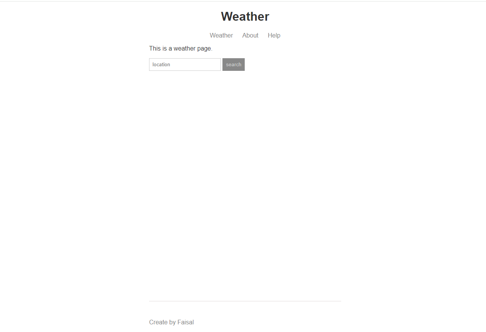
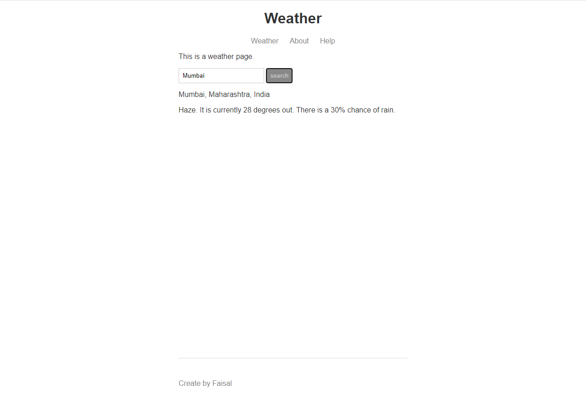

# Weather Website

This project is built on Node.js and Handlebars templates. Users can access the weather status of their area through this website.

## Table of Contents

- [Overview](#overview)
  - [The Problem](#the-problem)
  - [Screenshots](#screenshots)
  - [Links](#links)
- [My Process](#my-process)
  - [Built With](#built-with)
  - [What I Learned](#what-i-learned)
  - [Continued Development](#continued-development)
  - [Useful Resources](#useful-resources)
- [Author](#author)

## Overview

### The Problem

Users should be able to identify the weather of their area using this website.

### Screenshots

#### Desktop Preview

### Links

- [Live Site URL](https://faisal786111.github.io/FAQ/)

## My Process

### Built With

- Semantic HTML5 markup
- CSS custom properties
- Node.js

### What I Learned

I gained valuable insights into the proper use of templates and Node.js, as well as how to access third-party APIs to build a project. I used the weather API to create this project.

### Continued Development

#### 1. Advanced Node.js

I aim to deepen my understanding of advanced HTML and CSS techniques to enhance the visual appeal and responsiveness of my web projects. This includes exploring newer features such as grid layouts and flexbox, and mastering the art of creating seamless and visually appealing user interfaces.

#### 2. JavaScript Proficiency

To elevate my web development skills, I plan to focus on advancing my proficiency in JavaScript. This involves delving into more complex concepts, exploring modern frameworks, and honing my skills in asynchronous programming to create dynamic and interactive web applications.

#### 3. Node.js

This is my project of Node.js in which I have learned many template handlebars and how to access third-party APIs, etc.

### Useful Resources

- [OpenCageData](https://opencagedata.com/) - This helped me to identify the geo-location of an address.
- [Weatherstack](https://weatherstack.com/) - This helped me to identify the address of a given latitude and longitude.
- [MS Powertoys](https://learn.microsoft.com/en-us/windows/powertoys/) - This helped me to pick the colors I wanted.

## Author

- Twitter - [@Faisal_DevLife](https://twitter.com/Faisal_DevLife)
- LeetCode - [@faisalkhanisrar](https://leetcode.com/faisalkhanisrar/)
